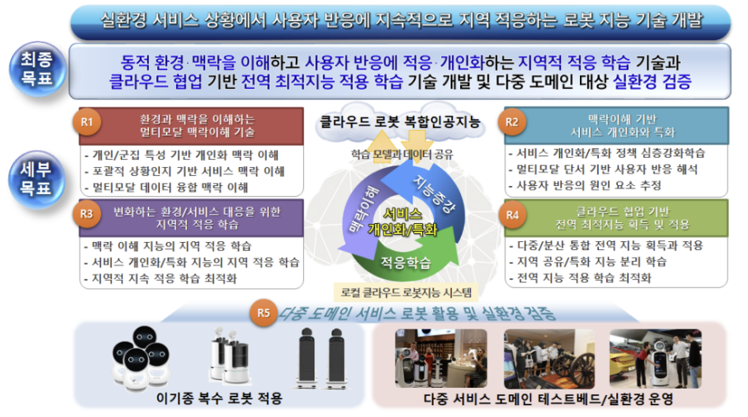
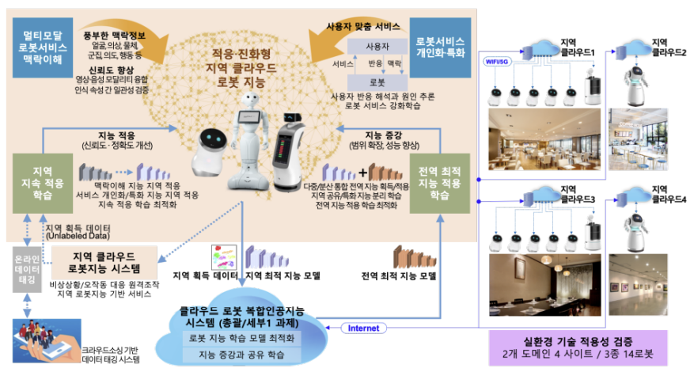
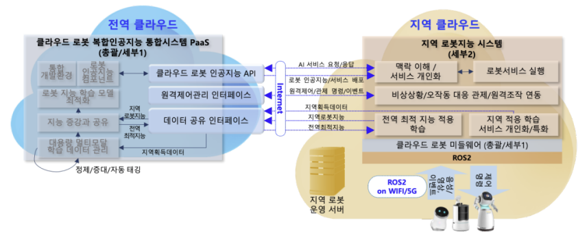

# 최종 목표

사용자의 멀티모달 상황을 실시간으로 반영하여 전후 맥락을
이해하고 서비스를 개인화 하는 로봇지능 지역 적응 학습 기술과
클라우드 협업을 통해 전역 최적화된 학습 결과를 공유받아 자체
지능을 개선 확장하는 클라우드 기반 전역 최적 지능 적용 기술을
개발하고 다중 , 도메인의 실환경을 통해 기술 적용성을 검증함

# 전체 내용

본 연구에서는 기존 로봇 지능의 한계를 극복하기 위해 아래의 4개
핵심 기술로 구성되는 클라우드 로봇 핵심 인공지능 기술을 개발함

- 개인과 군집의 다중 특징 행동 , 패턴 등 개인화 맥락과 물체의
  역할, 상태, 물체 간 관계 등 서비스 맥락을 이해하고 멀티모달
  데이터 융합과 다수의 인식 결과 간의 일관성 추론을 통해 맥락
  이해의 신뢰성을 향상하는 멀티모달 로봇 서비스 맥락이해 기술,
- 맥락 이해 결과를 기반으로 로봇 서비스를 제공하고 그에 대한
  사용자의 반응을 해석하고 그 원인을 유추함으로써 개인화 로봇
  서비스 정책을 최적화하는 로봇 서비스 개인화/특화 기술,
- 로봇 서비스 운용 지역의 환경과 사용자 특성 변화에 대응하기
  위해 지역 훈련 데이터를 스스로 수집하고 학습하여 성능을
  최적화하는 지속적 지역 적응 학습 기술,
- 클라우드 로봇 복합인공지능 시스템으로부터 전역 최적 지능을
  전달받아 지역 최적화 학습에 전이함으로써 로봇의 맥락이해와
  서비스 개인화 특화 / 능력을 향상하는 전역 최적 지능 적용 학습
  기술
- 또한, 상기 클라우드 로봇 핵심 인공지능 기술을 복수의 서비스
  도메인을 대상으로 테스트베드와 실환경에서 기술의 적용성을
  검증함

# 1단계

## 목표

클라우드 협업을 통해 전역 최적화된 지능을 융합하여 지역 맥락이해
지능을 증강하는 기술 개발 및 클라우드 로봇 복합인공지능과 연계된
서비스 로봇 실증

## 내용

- 멀티모달 개인화 맥락인식 정확도 95% 이상
- 클라우드 협업 기반 서비스 맥락이해 에러 감소율 15% 이상
- 지역 적응을 위한 도메인 적응 모델의 분류 정확도 51% 이상
- 지속 학습에 따른 서비스 개인화 성능 지속률 86% 이상
- 클라우드 로봇 복합인공지능 시스템 연동과 지역 로봇 지능이 탑재된 로봇 시스템 실증
- 실환경 서비스에 대한 사용자 반응 및 로봇 서비스 품질 분석

# 연구개발성과 활용계획 및 기대 효과

o 활용계획

- 본 과제 결과물은 SW, 소스코드, 라이브러리 형태로 활용할 수 있고 지역 클라우드
  로봇 지능 시스템은 로봇 SI업체들이 솔루션을 구축하는데 활용할 수 있으며,
  데이터셋은 로봇 인공지능 신기술 연구 개발에 · 활용 가능
- 본 과제에서 개발하는 핵심기술 SW와 데이터셋을 공개하고 커뮤니티를
  활성화함으로써 로봇과 인공지능 분야 비영리 기관의 연구개발에 활용하게 하고,
  기업의 경우 기술이전과 적극적 지원을 통해 관련 제품에 적용토록 함
- 본 기술은 다양한 서비스 도메인에 적용 가능하나 전방산업의 시장 규모가 크고
  확장성이 높은 식당, 레스토랑, 카페 도메인을 중심으로 수요처를 발굴하고
  총괄/ 세부1 기술과 통합된 클라우드 로봇 복합인공지능 기술 확산을 추진함

o 기대효과

- 총괄/세부1 과제 결과와 본 과제 결과의 결합 활용을 통해 실 운영 중인 로봇
  제품들의 지능 수준을 향상할 수 있으므로 이를 통해 로봇 인공지능 기술 경쟁력
  제고와 로봇 산업 확산 토대 마련 가능
- 5G의 초연결 초저지연 초고속 특성을 기반으로 비용 증가 없이 다양한 로봇
  인공지능 서비스를 제공할 수 있으므로 로봇 상용화 확대는 물론 5G 이동통신의
  빠른 확산과 발전도 기대할 수 있음
