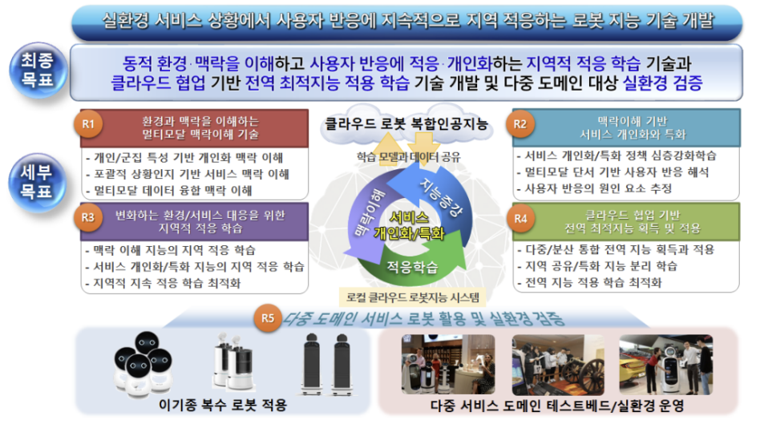
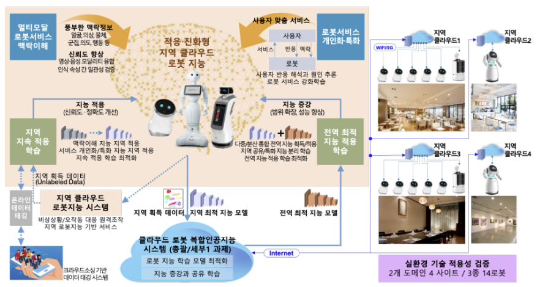

# End goal

By reflecting the user's multi-modal situation in real time, the context
Robot intelligence that understands and personalizes services, regional adaptive learning technology and
Through cloud collaboration, global optimized learning results are shared and self-contained
Cloud-based global optimal intelligence application technology that improves and expands intelligence
Developed and verified the applicability of the technology through the real environment of multiple domains

# Full content

In this study, in order to overcome the limitations of existing robot intelligence, the following four
Developed cloud robot core artificial intelligence technology consisting of core technologies

- Multiple characteristics of individuals and groups, behaviors, patterns, etc. of personalization contexts and objects
  Understanding service contexts such as roles, states, and relationships between objects and multimodal
  Context through data fusion and coherence reasoning between multiple recognition outcomes
  Multimodal robot service contextual understanding technology that improves the reliability of understanding;
- Provide robot services based on the results of understanding the context and
  A personalized robot by interpreting the user's reaction and inferring the cause
  Robot service personalization/specialization technology to optimize service policy,
- Responding to changes in the environment and user characteristics of the robot service operation area
  It collects and learns local training data by itself to improve its performance.
  continuous adaptive learning technology that optimizes,
- Global optimal intelligence from the cloud robot complex artificial intelligence system
  Understanding the robot context and transferring it to local optimization learning
  Globally optimal intelligence applied learning to improve service personalization specialization / ability
  technology
- In addition, the cloud robot core artificial intelligence technology can be applied to a plurality of services.
  The applicability of the technology in the test bed and in the real environment for the domain
  verified

# Step 1

## goal

Understanding multimodal contexts for personalized services that understand environments and contexts
To develop elemental technologies and to respond to the changing environment and services regionally
Developing Adaptive Learning Skills

## content

- Robot vision-based face/ 85% appearance feature information recognition accuracy or higher
- Over 75% of robot vision-based service context recognition accuracy
- Improved convergence recognition reliability as a result of multi-modal recognition between modules by 10% or more
- More than 85% accuracy in estimating customer response causes for service personalization
- Cluster size analysis and human localization error 6.3 MAE or less
- Local robot intelligence SW system based on cloud platform interworking

# Step 2

## goal

Converging global optimized intelligence through cloud collaboration to understand local context
Technology development that enhances intelligence and connected with cloud robot complex artificial intelligence
Service robot demonstration

## content

- Multimodal personalized context recognition accuracy of 95% or more
- Cloud collaboration-based service context understanding error reduction rate more than 15%
- Classification accuracy of 51% or more of domain adaptation model for regional adaptation
- Service personalization performance continuity rate over 86% according to continuous learning
- Cloud robot complex artificial intelligence system interlocking and demonstration of robot system equipped with local robot intelligence
- Analysis of user reaction and robot service quality to real environment service

# R&D performance utilization plan and expected effect

o Utilization plan

- The results of this project can be utilized in the form of SW, source code, and library, and
  The robot intelligence system can be used by robot SI companies to build solutions,
  Data set can be used for research and development of new robot artificial intelligence technology
- Disclose the core technology SW and data set developed in this project and encourage the community
  By activating it, it is used for research and development of non-profit organizations in the field of robots and artificial intelligence,
  In the case of a company, it is applied to related products through technology transfer and active support.
- This technology can be applied to various service domains, but the market size of the downstream industry is large and
  Discovery of demand sources centering on highly scalable restaurant, restaurant, and cafe domains,
  Promote the spread of cloud robot complex artificial intelligence technology integrated with general/detail 1 technology

o Benefit

- Robot in operation by combining the results of the general/detail 1 task and the results of this task
  It can improve the intelligence level of products, so it can make robot artificial intelligence technology competitive.
  Possible to lay the foundation for improvement and expansion of the robot industry
- Various robots without cost increase based on 5G's ultra-connected, ultra-low-latency, and ultra-high-speed characteristics
  Because it can provide artificial intelligence services, it is possible to expand the commercialization of robots and
  Rapid spread and development can also be expected.
